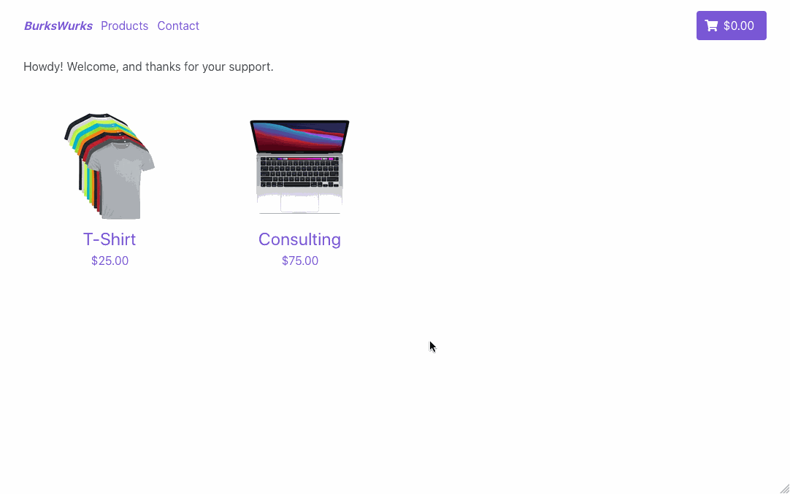

# BurksWurks

This is an sandbox project I created to play around with static site generators and javascript shopping cart services. By no means is this production ready.

## In Action

Or try it live (when available): [http://burkswurks.com/](http://burkswurks.com/)

## Tech Stack

* Gridsome as the static site generator - [https://gridsome.org/](https://gridsome.org/)
* Buefy for Bulma CSS styling - [https://buefy.org/](https://buefy.org/)
* Snipcart shopping cart platform - [https://snipcart.com/](https://snipcart.com/)
* Surge.sh for hosting - [https://surge.sh/](https://surge.sh/)

## Inspiration

* [https://snipcart.com/blog/gridsome-ecommerce-tutorial](https://snipcart.com/blog/gridsome-ecommerce-tutorial)
* [https://strapi.io/blog/building-a-jamstack-food-ordering-app-with-strapi-gridsome-and-snipcart-1-6](https://strapi.io/blog/building-a-jamstack-food-ordering-app-with-strapi-gridsome-and-snipcart-1-6)